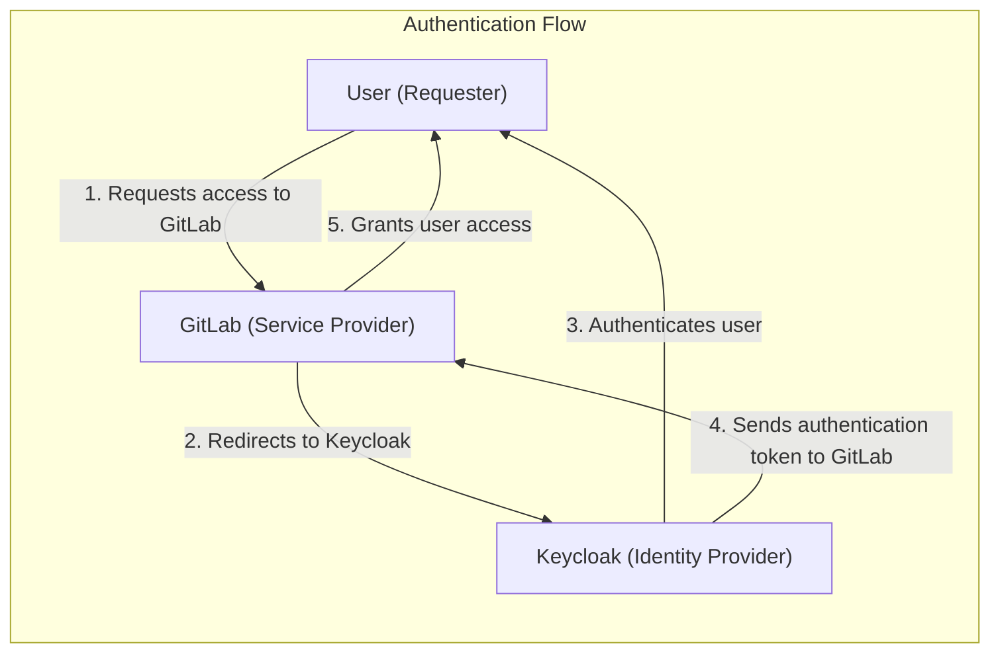
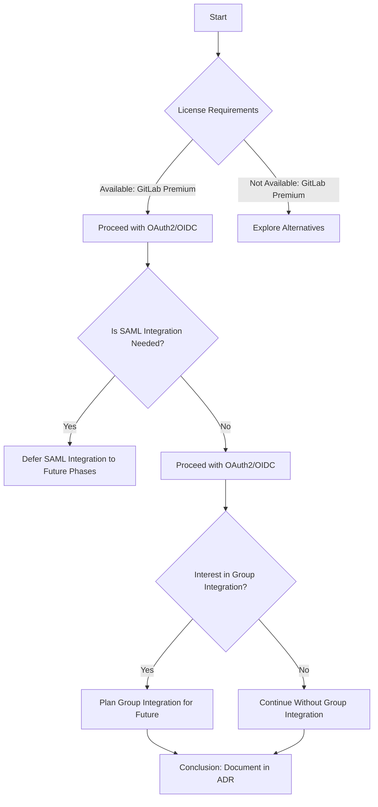
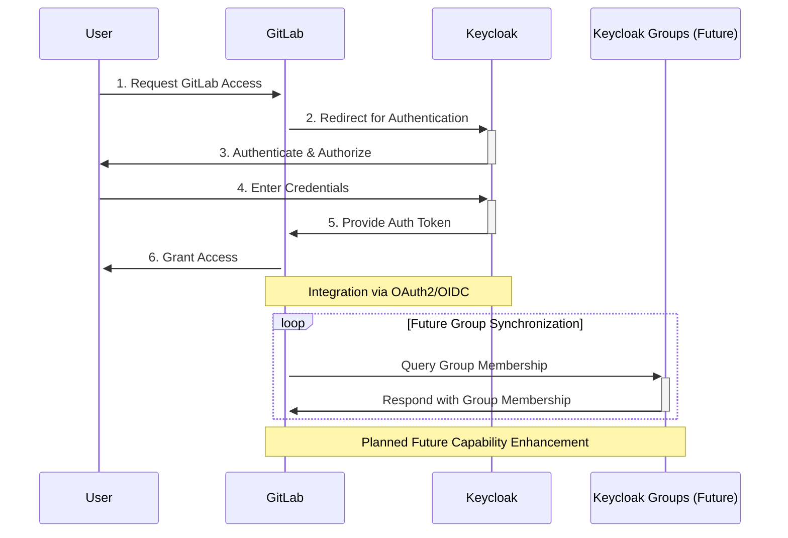

#### Architectural Decision Record (ADR): Integration of Keycloak with GitLab for Authentication

#### Status
Proposed

#### Date
2024-03-05

#### Introduction
This ADR supports the further integration of Keycloak with GitLab to streamline authentication mechanisms, with the goal of enhancing security and user experience. The drive behind this initiative is to refine login processes, bolster security protocols, and ensure compliance with Information Assurance (IA) standards.

**Objective**: Utilize Keycloak as the predominant Identity and Access Management (IAM) solution alongside GitLab, applying OAuth2 for authentication. This plan aims to consolidate user management and authentication, making credential management more straightforward and improving our security landscape.

**Rationale**: The integration of authentication between Keycloak and GitLab is fundamental for facilitating seamless user access, elevating security via centralized oversight, and adhering to compliance standards. This commitment is built on our adherence to open authentication and authorization standards, such as OAuth2 and OpenID Connect (OIDC).

#### Decision Process
The decision to further integrate Keycloak with GitLab was informed by evaluating several key factors and prerequisites:

- **SAML Integration**: Our initial focus is on OAuth2/OIDC, with SAML integration to be considered in later phases, allowing us to stay adaptive to technology advancements.
- **License Requirements**: Presumes availability of GitLab Premium, vital for advanced authentication features, ensuring we can fully leverage GitLab's capabilities.
- **RMF/Control Compliance**: Security and compliance are prioritized from the start, though comprehensive RMF documentation will be addressed progressively.
- **Group Integration**: Future developments will explore Keycloak and GitLab group integration to enhance access control and permission management.

#### Current Usage and No Need for Prototype
Keycloak is already deployed as an authentication solution within our GitLab environment. This existing use case provides us with practical insights and confidence in the technology's reliability and effectiveness for our needs. Given this proven track record, we believe there is no need for a prototype phase for further integration. Our focus will instead be on enhancing and expanding the current integration to meet additional security and user experience goals.

#### Implications
- **Security and Compliance**: Aims to heighten security and compliance standards, with an understanding that detailed RMF documentation and compliance will develop over time.
- **User Experience**: Foresees significant improvements in user experience by offering streamlined access across services.
- **License Management**: Emphasizes the critical role of GitLab Premium for accessing sophisticated authentication features.
- **Future Enhancements**: Envisions upcoming developments, especially the integration of Keycloak with GitLab groups, to further refine access controls and permission management.

#### Strategy for Integration
1. **OAuth2/OIDC Configuration**: Implement

 Keycloak as the OAuth2 provider for GitLab, focusing on secure and efficient authentication processes.
2. **Comprehensive Testing**: Carry out thorough testing to ensure the authentication mechanism functions smoothly, prioritizing security and user satisfaction.
3. **Security and Compliance Review**: Undertake an initial assessment to identify any potential vulnerabilities or compliance issues, aiming for ongoing improvement and adherence to security standards.

#### Moving Forward
- **Stakeholder Engagement**: Align the integration strategy and execution with stakeholder expectations and organizational goals, ensuring a collaborative and supported approach.
- **Iterative Development**: Roll out the integration based on the strategy outlined, making adjustments based on feedback and discoveries, with scalability and future capabilities in mind.

This ADR charts a strategic course for the enhanced integration of Keycloak with GitLab, addressing immediate needs while laying a foundation for future security and compliance advancements.

#### References
- [Requirement Clarifications ](https://github.com/defenseunicorns/uds-package-gitlab/issues/54#issuecomment-1977620707)
- [OAuth2 and OpenID Connect](https://www.keycloak.org/docs/latest/server_admin/index.html#_oauth2)
#### Additional References for GitLab and OAuth Authentication
- **GitLab and OAuth2 Integration**: For a comprehensive guide on integrating GitLab with OAuth2 for authentication, refer to the [GitLab OAuth2 provider documentation](https://docs.gitlab.com/ee/integration/oauth_provider.html). This resource provides detailed instructions on setting up GitLab as an OAuth2 provider, enabling secure and efficient user authentication.
- **Keycloak and OAuth2**: To understand how Keycloak can be configured as an OAuth2 authentication provider for various services, including GitLab, visit the [Keycloak OAuth2 documentation](https://www.keycloak.org/docs/latest/securing_apps/index.html#_oauth2). This documentation offers insights into the OAuth2 protocol, how Keycloak supports it, and the steps required to integrate Keycloak with services requiring OAuth2 authentication.
