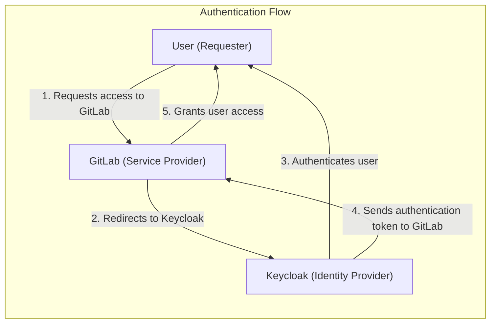
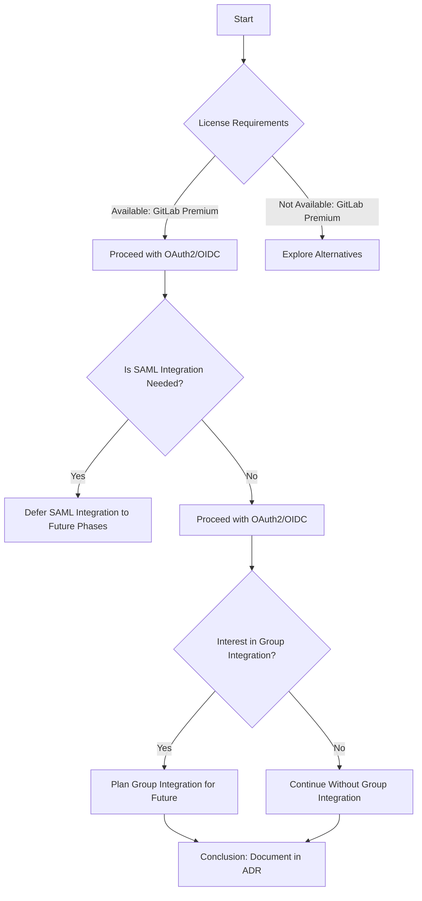
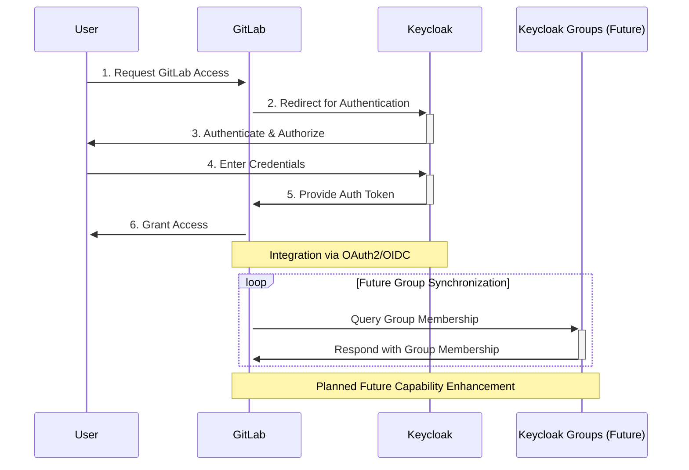
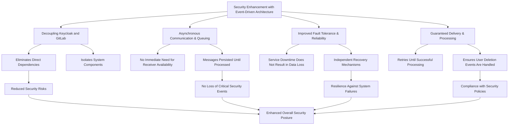
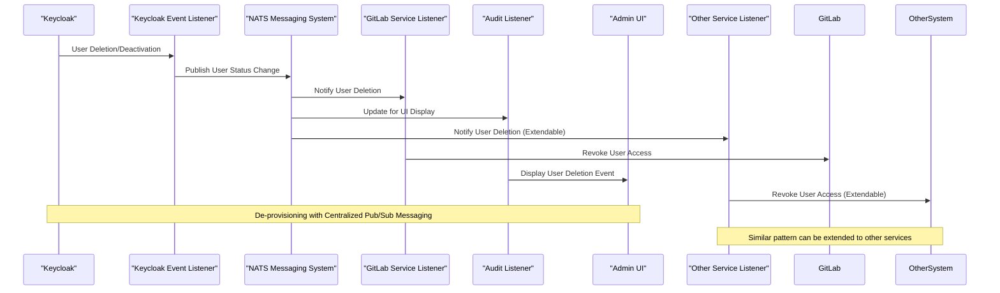
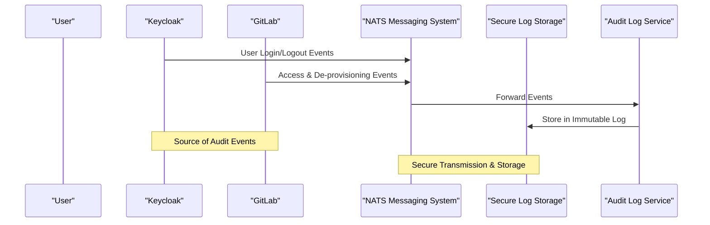

#### Architectural Decision Record (ADR): Integration of Keycloak with GitLab for Authentication

#### Status
Proposed

#### Date
2024-03-05

#### Introduction
This ADR supports the further integration of Keycloak with GitLab to streamline authentication mechanisms, with the goal of enhancing security and user experience. The drive behind this initiative is to refine login processes, bolster security protocols, and ensure compliance with Information Assurance (IA) standards.

**Objective**: Utilize Keycloak as the predominant Identity and Access Management (IAM) solution alongside GitLab, applying OAuth2 for authentication. This plan aims to consolidate user management and authentication, making credential management more straightforward and improving our security landscape.

**Rationale**: The integration of authentication between Keycloak and GitLab is fundamental for facilitating seamless user access, elevating security via centralized oversight, and adhering to compliance standards. This commitment is built on our adherence to open authentication and authorization standards, such as OAuth2 and OpenID Connect (OIDC).

#### Decision Process
The decision to further integrate Keycloak with GitLab was informed by evaluating several key factors and prerequisites:

- **SAML Integration**: Our initial focus is on OAuth2/OIDC, with SAML integration to be considered in later phases, allowing us to stay adaptive to technology advancements.
- **License Requirements**: Presumes availability of GitLab Premium, vital for advanced authentication features, ensuring we can fully leverage GitLab's capabilities.
- **RMF/Control Compliance**: Security and compliance are prioritized from the start, though comprehensive RMF documentation will be addressed progressively.
- **Group Integration**: Future developments will explore Keycloak and GitLab group integration to enhance access control and permission management.

### User Deletion and Deprovisioning
The integration of Keycloak with GitLab will also address user deletion and deprovisioning, ensuring that user access is managed effectively. This is the case where an user is removed from Keycloak, but the user still can access keycloak with PAT and SSH keys. This is a security risk and should be addressed. This is a critical requirement for security and compliance.

#### Considerations
- **User Deletion**: When a user is deleted from Keycloak, their access to GitLab should be revoked, ensuring that user access is managed effectively.
- **Deprovisioning**: The deprovisioning process should be automated, ensuring that user access is revoked in a timely manner, reducing security risks.
- **Security and Compliance**: This capability is critical for security and compliance, ensuring that user access is managed effectively and securely.
- **Reliability and Scalability**: The deprovisioning process should be reliable and scalable, ensuring that user access is managed effectively as the organization grows. The message delivery should be reliable and cannot be lost as this can lead to security lapse.
- **Audit and Reporting**: The deprovisioning process should be auditable and reportable, ensuring that user access is managed effectively and securely.

#### Design
Our design strategy focuses on enhancing security and compliance through an automated and reliable user deprovisioning process. This process is critical for maintaining secure access across various services including GitLab, Mattermost, and SonarQube. The design consists of three main components:

1. **Keycloak Event Listener**: A custom event listener will be implemented within Keycloak to monitor and react to user deactivation or deletion events. This listener is the cornerstone of our event-driven architecture, ensuring that user status changes are captured without delay.

2. **NATS Messaging System**: Upon capturing a user status change event, the Keycloak event listener will publish a message to a NATS topic. NATS has been selected for its high reliability, scalability, and performance, making it an excellent choice for microservices architectures, especially those deployed on Kubernetes. Its features include:
   - **High Performance**: Ensuring high throughput and low latency, ideal for real-time applications.
   - **Fault Tolerance**: Through clustering, NATS achieves high availability, safeguarding against node failures.
   - **Scalability**: Capable of handling a growing number of clients and messages, efficiently distributing messages across subscribers.
   - **Security**: Supports TLS/SSL for secure communication between clients and servers.

3. **Service for API Updates**: A dedicated service will subscribe to the NATS topic to process messages related to user deactivation or deletion. This service will then interact with the APIs of GitLab, Mattermost, SonarQube, and other integrated services to revoke the user's access. This approach ensures a seamless and automated deprovisioning process across all services, enhancing our security posture.

This design not only automates the user deprovisioning process but also establishes an event-driven architecture that minimizes tight coupling between services. By leveraging NATS within a Kubernetes environment, we ensure that our architecture is both scalable and resilient, capable of adapting to the evolving needs of our infrastructure and services.

The provided sequence diagram illustrates a scalable and decoupled architecture for handling user deprovisioning, leveraging NATS for centralized publish/subscribe messaging. This pattern ensures that when a user is deleted or deactivated in Keycloak, the event is published to NATS, from where it is distributed to various service listeners, including a GitLab Service Listener and an Audit Listener. The GitLab Service Listener is responsible for revoking the user's access in GitLab, while the Audit Listener updates the Admin UI to display the user deletion event. This architecture can be easily extended to include additional services by adding more listeners that subscribe to the relevant NATS topics for user status changes.

This diagram highlights the flexibility and scalability of using NATS for event-driven communication across different services within an organization's infrastructure. By adding more service listeners (e.g., "Other Service Listener") for additional systems (e.g., "OtherSystem"), this architecture allows for seamless integration and handling of user deprovisioning events across a wide array of services, ensuring a consistent and secure approach to access management and compliance.

#### Security between Services
The security between services is a critical aspect of the proposed architecture. The communication between Keycloak, the event listener, NATS, and the various service listeners must be secure to ensure the integrity and confidentiality of user deprovisioning events. The following security measures will be implemented:
- **TLS/SSL**: All communication between Keycloak, the event listener, NATS, and the service listeners will be encrypted using TLS/SSL to ensure data confidentiality and integrity. This will be achieved by utilizing istio for mutual TLS between services. This will  Strict mTLS will be enforced between services to ensure that only authorized entities can communicate with each other.

- **Restricted Access**: Access to the event listener, NATS, and the service listeners will be restricted to authorized entities only using Kubernetes Network Policies and istio authorization policies.

#### Implications
- **Security and Compliance**: Aims to heighten security and compliance standards, with an understanding that detailed RMF documentation and compliance will develop over time.
- **User Experience**: Foresees significant improvements in user experience by offering streamlined access across services.
- **License Management**: Emphasizes the critical role of GitLab Premium for accessing sophisticated authentication features.
- **Future Enhancements**: Envisions upcoming developments, especially the integration of Keycloak with GitLab groups, to further refine access controls and permission management.

### Audit trail
The integration of Keycloak with GitLab will also address the need for an audit trail, ensuring that all user access and deprovisioning events are logged and auditable. This is a critical requirement for security and compliance.

#### Considerations
- **Audit Logging**: All user access and deprovisioning events should be logged and stored securely to ensure that they are auditable.
- **Security and Compliance**: This capability is critical for security and compliance, ensuring that all user access and deprovisioning events are logged and auditable.
- **Reliability and Scalability**: The audit logging process should be reliable and scalable, ensuring that all user access and deprovisioning events are logged and auditable as the organization grows.

#### Design Overview
The cornerstone of our design strategy is to fortify security and compliance measures through a robust and scalable audit logging framework. This framework is designed to meticulously record and securely preserve all user access and deprovisioning activities, thereby facilitating comprehensive auditability and detailed reporting. In its initial deployment, our focus will be on establishing three foundational components. Direct event capture via Keycloak's Service Provider Interface (SPI) and the utilization of the NATS system for creating an append-only log structure are earmarked for subsequent integration to enhance the audit log's reliability and authenticity. Furthermore, we plan to incorporate hash chaining within the append-only log to guarantee data immutability and offer a formidable barrier against data manipulation attempts. These advancements are anticipated to significantly augment the audit log's security posture in future iterations.

- **Security Model Alignment**: If your design for user deprovisioning, audit trails, or secure logging aligns with the security model of TUF, which includes ensuring the integrity and authenticity of data, referencing go-tuf can provide additional context and validation for your approach.

- **Immutable Log Integrity**: TUF's approach to securing software update systems includes mechanisms for ensuring that updates (or in your case, log entries) have not been tampered with. This is closely related to the concept of immutable logs with hash chaining, where each entry's integrity can be verified independently.

-Future Enhancements: If there are plans to explore or implement features that ensure the security of distributed data or updates within your system, referencing go-tuf could indicate a direction for future research and development efforts.

## Strategy for Integration
1. **OAuth2/OIDC Configuration**: Implement

 Keycloak as the OAuth2 provider for GitLab, focusing on secure and efficient authentication processes.
2. **Comprehensive Testing**: Carry out thorough testing to ensure the authentication mechanism functions smoothly, prioritizing security and user satisfaction.
3. **Security and Compliance Review**: Undertake an initial assessment to identify any potential vulnerabilities or compliance issues, aiming for ongoing improvement and adherence to security standards.

#### Moving Forward
- **Stakeholder Engagement**: Align the integration strategy and execution with stakeholder expectations and organizational goals, ensuring a collaborative and supported approach.
- **Iterative Development**: Roll out the integration based on the strategy outlined, making adjustments based on feedback and discoveries, with scalability and future capabilities in mind.

This ADR charts a strategic course for the enhanced integration of Keycloak with GitLab, addressing immediate needs while laying a foundation for future security and compliance advancements.

#### References
- [Requirement Clarifications ](https://github.com/defenseunicorns/uds-package-gitlab/issues/54#issuecomment-1977620707)
- [OAuth2 and OpenID Connect](https://www.keycloak.org/docs/latest/server_admin/index.html#_oauth2)
#### Additional References for GitLab and OAuth Authentication
- **GitLab and OAuth2 Integration**: For a comprehensive guide on integrating GitLab with OAuth2 for authentication, refer to the [GitLab OAuth2 provider documentation](https://docs.gitlab.com/ee/integration/oauth_provider.html). This resource provides detailed instructions on setting up GitLab as an OAuth2 provider, enabling secure and efficient user authentication.
- **Keycloak and OAuth2**: To understand how Keycloak can be configured as an OAuth2 authentication provider for various services, including GitLab, visit the [Keycloak OAuth2 documentation](https://www.keycloak.org/docs/latest/securing_apps/index.html#_oauth2). This documentation offers insights into the OAuth2 protocol, how Keycloak supports it, and the steps required to integrate Keycloak with services requiring OAuth2 authentication.

#### Additional References for Keycloak Custom Event Listener
For detailed guidance on creating and deploying a custom event listener in Keycloak, refer to the [Keycloak Custom Event Listener documentation](https://www.keycloak.org/docs/latest/server_development/index.html#_events). This resource provides comprehensive instructions on how to extend Keycloak's functionality through the development of custom event listeners, enabling tailored handling of authentication and user management events.

#### The Update Framework (TUF) and go-tuf

- **go-tuf (The Update Framework in Go)**: For insights into secure distribution and integrity verification mechanisms, go-tuf implements The Update Framework (TUF) in Go. TUF is designed to prevent various attacks on software update systems and can inspire approaches to ensuring the integrity of immutable logs with hash chaining. More information can be found in the [go-tuf GitHub repository](https://github.com/theupdateframework/go-tuf).

#### nats.io references
- [NATS Documentation](https://docs.nats.io/)
- [NATS on Kubernetes](https://docs.nats.io/nats-on-kubernetes/nats-on-kubernetes)
- [NATS Security](https://docs.nats.io/nats-on-kubernetes/nats-on-kubernetes)

